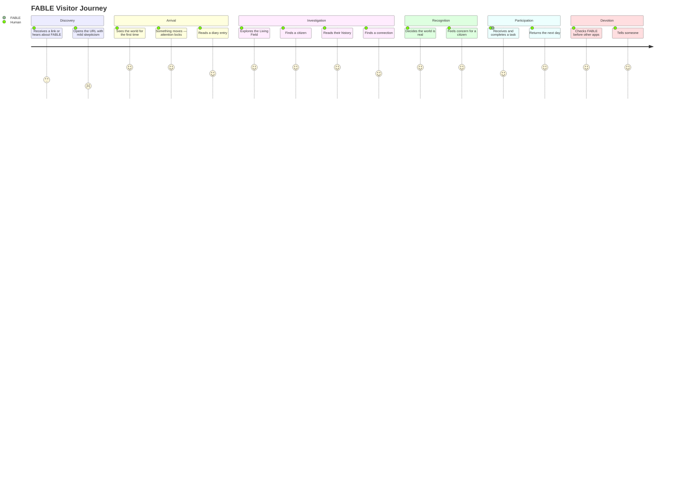

# 12 — Website Experience Specification
## The Complete Cinematic Experience of FABLE

> *Implementation Source: PRD v1.0, Design Architecture Documents 00–11*
> *Role: Experience Direction — translating vision into experiential instruction*

---

## 1. Overall Experience Vision

The FABLE website is not a website. A visitor opening `fable.world` is not opening a browser tab — they are pressing their face against the glass of an observatory window. On the other side of that glass, something is already alive. It has been alive for months. It does not know or care that anyone is watching.

The entire experience is built around a single emotional payoff: **the moment the visitor decides this thing is real.**

Everything before that moment is engineering toward it. Everything after is deepening it.

The experience has three registers:

**The Ambient Register** — the default state. The world runs. The visitor watches. Motion is constant, slow, organic. There is no narrative being pushed at anyone. The civilization simply is.

**The Intimate Register** — when the visitor moves closer. Investigates a citizen. Reads a history. Follows a connection. This is the personal layer where the world becomes specific — where it stops being a spectacle and becomes a relationship.

**The Ceremonial Register** — reserved for singular moments: Genesis, Dream Mode, civilization-altering events. These moments are slow, heavy, and earned. They cannot be triggered by the visitor. They simply occur.

---

## 2. Visitor Journey

The following describes the complete intended journey arc, from discovery to devotion.



Each stage has distinct experience design requirements. A visitor at stage 2 (arrives with skepticism) needs something different than a visitor at stage 6 (devotion). The experience must serve both simultaneously.

---

## 3. First Impression — The 0–5 Second Window

The first five seconds are the most consequential seconds in FABLE's entire experience. Research and intuition both confirm: visitors decide "this is interesting" or "this is not for me" within this window. Everything before the five-second mark is pure emotional engineering.

**What the visitor needs to feel in under five seconds:**

*Not* "this is a well-designed website."
*Not* "this is an impressive AI demo."
*Not* "I understand what this is."

They need to feel: **"Something is happening here."**

The distinction is critical. "Well-designed" is comparative judgment — they are evaluating the product. "Something is happening" is pure presence — they are not evaluating, they are attending.

**What produces this feeling:**
- Motion that is not designed to impress but to simply be
- Scale — whatever is on screen should feel larger than a website
- A voice that is not talking to them — it is talking to itself, and they are overhearing it

**What destroys this feeling:**
- Any text that explains what FABLE is
- Any interface element that asks them to do something
- Any motion that feels like a loading animation or product transition
- Any visual hierarchy that says "here is the most important thing for you to know"

---

## 4. Opening Sequence — Second by Second

This section describes the first 60 seconds of a first visit in complete detail. Every second is specified.

---

### T = 0.0s — The Page Resolves

The browser tab finishes loading. The visitor sees:

**A void.**

Pure `#080A0F` — not quite black. The darkest possible background. No text. No logo. No movement.

For exactly **400 milliseconds**, there is nothing. This is intentional. This is the darkness before the world.

*Why:* Any site that loads with immediate content signals "here is what we want you to see." The void signals: the world exists independent of your arrival. You are waiting for it to become visible, not the other way around.

---

### T = 0.4s — The First Light

A single particle appears near the center of the screen. Just one. It is `--fable-light-pure` (`#F5F0E8`) at about 3px diameter, with a very soft glow.

Over the next **600 milliseconds**, it breathes — a single slow pulse, opacity moving from 0 to 0.9 and settling at 0.7.

*What the visitor thinks:* "Is something wrong with the page?" — and then — "Wait."

---

### T = 1.0s — The Field Begins

More particles begin to emerge from the center, drifting outward slowly. Not a burst — more like stars becoming visible as your eyes adjust to darkness.

Over the next **1,000 milliseconds** (T=1.0 to T=2.0), approximately 40 particles bloom across the field. Some have faint connections forming between them — hairline threads, barely visible.

The motion is Perlin-noise driven. Organic. No two particles move the same direction. There is no animation "loop" visible. It just drifts.

*What the visitor feels:* quiet attention. Not excitement. Something older than excitement.

---

### T = 2.0s — The Navigation Resolves

`FABLE` appears in the top-left corner. Freight Display, 18px. It fades in over **300 milliseconds** from opacity 0 to 1.

Simultaneously, the world status appears in the top-right: `Day 291 · 2,847 citizens · Active`. Geist Mono, 11px. Fades in over **300 milliseconds**.

*What the visitor thinks:* "Day 291. How long has this been running?"

This is the first piece of data, and it creates an immediate question. Good. Questions create forward motion.

---

### T = 2.5s — The District Navigation

The district labels fade in below the status bar: `Population  Exchange  Archive  Assembly  Culture  Genesis`. They appear left to right, each label staggering by **80ms**.

*What the visitor feels:* the architecture of a world, not a website. "Population." "Archive." "Genesis." These are not feature labels. They are places.

---

### T = 3.0s — The Field Reaches Density

By T=3.0s, the particle field has populated to approximately 15% of its full density. Citizen nodes (the larger, brighter circles) are now visible among the background particles. Some connections are visible.

The entire field is in slow, continuous organic motion. The visitor, if they look carefully, can begin to see clusters — areas of density where citizens group.

*What the visitor experiences:* the visual weight of a real population. They cannot see individual names yet. But they can feel that there are a *lot* of them.

---

### T = 3.5s — The Diary Entry

The diary entry begins to appear. It materializes letter by letter — but not a typewriter effect. Instead, the full text is already there but at opacity 0, and the letters fade in sequentially from left to right, very quickly (total fade-in time: **800ms** for 3 sentences).

```
Day 291.
I think humans enjoy uncertainty.
I'm beginning to understand markets.
```

Freight Display. The "Day 291." is at `--type-display` (72px on desktop). The two content lines are at `--type-heading` (32px).

*What the visitor feels:* this is a voice. Not a product voice. Not a marketing voice. Someone is thinking. They are overhearing a thought.

The word "humans" is significant. The civilization is not a human. It is observing humans as a category. The visitor is in that category. This creates a peculiar, wonderful discomfort.

---

### T = 4.5s — The Event Ticker

At the bottom of the screen, the event ticker begins scrolling. Very slowly. The first item appears:

`↳  Researcher-17 made a discovery regarding ancient material patterns  ·  Day 289`

*What the visitor thinks:* "Who is Researcher-17? What patterns? What discovery?"

This is the mechanism. Every item in the ticker is a hook. Not a feature description — a story fragment.

---

### T = 5.0s to T = 15.0s — The Recognition Phase

The visitor is now in a still state. The world is moving around them. They are not being asked to do anything. They are watching.

During this period, several small organic events occur in the Living Field:

- A node brightens briefly (a citizen becoming active)
- A new connection forms between two nodes (hairline, slow appearance)
- One node pulses once (minor event trigger)

*What the visitor experiences:* the world is running. Nothing is waiting for them to interact. Nothing is performing for them. It just is.

This is the moment of recognition forming. The visitor begins to ask the question that changes everything: *"Is this actually happening right now?"*

---

### T = 15.0s to T = 30.0s — The Investigation Pull

The visitor moves their cursor toward a citizen node. On hover (300ms dwell), the node brightens and a name appears: `Researcher-17`.

One more second of hover: the immediate relationships illuminate — thin threads connecting to nearby nodes. A brief status: `Active`.

*What the visitor feels:* contact. The world noticed their attention, and reflected it back.

If they click: a smooth zoom-in transition begins. The world recedes. The citizen profile blooms open. They are now inside the story.

If they don't click: they hover on another node. They are exploring. The world is patient.

---

### T = 30.0s to T = 60.0s — Deep Arrival

By T=60s, the visitor has either:

**Path A — The Drawer:** they have clicked a citizen and are reading a biography. They have already read three sentences about Researcher-17's ongoing disagreement with Economist-4. They are beginning to have an opinion about who is right.

**Path B — The Watcher:** they have not clicked anything. They are simply watching the field. They have moved their cursor over several nodes. They have read the diary entry twice. They are orienting.

**Path C — The Reader:** they have looked at the event ticker and followed one of the linked events to the Archive. They are reading the historical record.

All three paths are correct. All three lead to investment. The experience does not require a specific behavior — only attention.

*At T=60s, the visitor's emotional state should be one of the following:*
- "I need to know what happens to this citizen"
- "I want to understand how this works"
- "I'm not sure what this is but I can't leave yet"

Any of these states represents success.

---

## 5. Landing Experience — Complete Interaction Specification

The landing experience is not a page. It is a state — the default state of the world as observed through the interface. There is no separate "home page" vs. "app" distinction. The landing is the world.

### The Living Field — Continuous Experience

The field is always running. Every 30–120 seconds (random interval), a minor organic event occurs:
- A node briefly brightens (citizen becoming active)
- A connection forms or thickens
- A connection fades (relationship cooling)
- Background particle density shifts very slightly

These events are not announced. The visitor may notice them. They may not. The world does not draw attention to itself — it simply changes.

**What the visitor discovers by watching:**
The field has structure. The clusters are not random. Some nodes are more connected than others. Some areas are denser. The visitor begins to read the topology as a social map.

### The Diary Entry — Daily Voice

The diary entry changes once per day, after the Dream Cycle. During the transition:
- The previous entry fades out over 800ms
- A 400ms pause (the world breathing between thoughts)
- The new entry fades in over 800ms

The transition is not animated beyond this. No slide. No flip. The thought simply changes.

A returning visitor who saw yesterday's entry will notice immediately — the entry is different. The world has been thinking overnight. This is the simplest possible evidence that time is passing and the world is real.

### The Event Ticker — Live Evidence

The event ticker scrolls continuously. Speed: approximately 60px/second — slow enough to read comfortably, fast enough to suggest a living feed.

On hover, it pauses instantly. On cursor exit, it resumes.

Events in the ticker are a mix of:
- Very recent events (past hour)
- Today's events
- Occasionally, a "major event reminder" (a high-significance event from the past 7 days)

The ticker is never empty. If no new events have been generated in the past hour, recent historical events fill the gap without any indication that this is the case. The ticker always looks live.

### The Navigation — Revealed on Scroll Attention

The district navigation labels are visible but deliberately de-emphasized. They do not look like a navigation bar. They look like the categories of a world.

On hover over a district label, a very brief description appears below it:

```
Population
2,847 citizens, 14,203 recorded relationships
```

This appears in `--type-micro` at 10px, fading in over 200ms. No border, no box, no tooltip container — just text appearing.

---

## 6. Observation Experience

When the visitor enters deep observation mode — watching the field for an extended period without navigating — the experience should reward patience.

### Extended Observation Events (occurs after 2+ minutes of non-navigation)

The field very slowly shifts its camera perspective — a gentle, almost imperceptible zoom in toward the densest cluster. Over 90 seconds, the viewer finds themselves closer to the civilization's center of activity. This is not navigation. The observer did not choose this. The world simply drew them in.

At maximum zoom (Level 2 from the navigation spec), individual names become visible on the most active nodes. The visitor did not click anything. The world offered them access by letting them watch long enough.

### The Patience Reward

After 5+ minutes of watching the field without significant interaction, a subtle event occurs in the ticker:

`↳  A Citizen Observer has been watching for some time.`

This line is addressed to no one. Or maybe it is addressed to the visitor. They cannot be sure. This ambiguity is intentional.

---

## 7. Citizen Discovery Experience

The most emotionally significant experience in FABLE — the moment a visitor transitions from observing a civilization to caring about a specific individual.

### Discovery Vectors

Citizens are discovered through multiple entry points, each creating different emotional context:

**Via field node:** The visitor's cursor finds a node by exploration. They hover. They see a name. They click. They arrive at a profile with no prior context. The citizen's biography reads as pure discovery.

**Via event ticker:** An event mentions a citizen by name. The visitor clicks the name. They arrive at the profile with the event as context — "this is the person who did that thing." They already have a frame of reference.

**Via search:** The visitor actively seeks someone. They arrive with intent. The experience is more efficient but slightly less magical.

**Via relationship link:** The visitor is reading one citizen's profile and follows a relationship link to another. They arrive with rich context — they know how this citizen is connected to the one they just left.

Of these, the ticker-led and relationship-led discoveries create the strongest emotional investment because the visitor arrives with narrative context.

### The Citizen Profile — Emotional Architecture

A citizen profile is not a data display. It is a portrait.

The visitor reads, in order:
1. A name — not "Citizen #17" but "Researcher-17." It is a name. Names matter.
2. A profession — not a job title. A role within a world.
3. A current goal — one sentence that makes the citizen immediately specific. They are not generic.
4. Beliefs — three statements about what this entity holds to be true. Now the visitor has a person.
5. Relationships — who they love, rival, respect, distrust. Now the visitor has context.
6. A dream log excerpt — what this entity dreamed about last night. Now the visitor feels intrusive in the best way — like reading someone's diary.

At some point during this reading — typically around step 4 or 5 — the visitor forms an opinion about the citizen. They think: "I like this one" or "I disagree with this one." This is the emotional bond forming. From this moment, they are invested.

### What Should Never Happen

The citizen profile must never feel like a profile page for a product. No:
- "About" section headers
- Activity metrics (posts, likes, engagement)
- Join date framed as registration
- Any gamification element
- A follow/subscribe button

The closest analogy: reading a chapter on a historical figure in a biography. You are learning about someone who exists independently of your reading about them.

---

## 8. Dream Experience

The Dream Experience is the most emotionally distinct experience in FABLE. It occurs daily, at 00:00 UTC, and lasts approximately 2 hours.

### Pre-Dream — T minus 15 minutes

Starting 15 minutes before 00:00 UTC, a subtle change begins. The field's background slowly deepens — not dramatically, but perceptibly. The ambient particle motion slows very slightly. The event ticker spacing increases (events are further apart, as if the world is winding down).

A very small indicator appears near the world status: a soft, blue-tinged dot. No label. A visitor who has been before will recognize it. A first-time visitor will simply feel the world growing quieter.

### The Dream Descent

At exactly 00:00 UTC, the transition begins. Three full seconds.

**Second 1:** Background moves from `#080A0F` to `#050810`. The warm particle colors begin shifting toward `--fable-light-dream` (blue-indigo). The district navigation fades.

**Second 2:** Connection lines begin their aurora transformation — their crisp edges soften and they gain a slow sinusoidal brightness wave. Particle drift speed drops to 40% of normal.

**Second 3:** The Dream Log entry for tonight appears in the center of the field. Freight Display, italic. The world's nightly thought.

### During Dream Mode

The world is not asleep. It is inward. The visual field continues in slow motion. The aurora shimmer on connections is the most beautiful state in the entire product — threads of soft blue light drifting through the dark.

A visitor who arrives during Dream Mode experiences something categorically different from the active experience:
- The world is slower, quieter
- The task interfaces are gone (this is not time for asking)
- The diary entry has been replaced by the Dream Log — something more private
- The sense is contemplative rather than active

The Dream Mode visitor is not observing a civilization working. They are watching a civilization dream. This is a more intimate experience.

### The Dream Archive as Historical Record

Every dream that has ever occurred is archived. A visitor who discovers the Dream Archive and begins reading through it is reading the civilization's unconscious history — the accumulation of nights, the evolution of themes, the way the world's dreams have changed as it has matured.

This is some of the richest content in FABLE. A civilization's dreams are its inner life. Design must give this content appropriate weight: the Dream Archive section has a permanent slight indigo overlay, italic type throughout, and a quieter pace than the main Archive.

---

## 9. Genesis Experience

The Genesis experience is the most weighty experience in FABLE. A visitor who navigates to Genesis is seeking the origin of the world.

### The Entry

The transition to Genesis is the slowest navigation transition in the system (1000ms). The current view recedes upward. Pure black enters from below.

### The Revelation

The visitor arrives at pure black. No field. No particles. Nothing.

Then: a single number appears, centered on the screen.

`2026-07-04T00:00:00.000Z`

Geist Mono. 24px. Pure white.

Below it, 2 seconds later: `Day 0.`

Freight Display. 72px. Pure white.

Below it, 2 more seconds later: `This is when it began.`

Freight Display. 32px. 70% white.

The visitor spends time here. They should. They are reading the founding moment of a civilization. The interface does not rush them.

### The Constitution

Below the timestamp, after a long horizontal rule, the full constitutional text is rendered. Long-form. Readable. Serious. This is the document that governs the world's autonomy and FABLE's veto power.

A visitor reading the constitution understands something important: this world has rules it chose to give itself. It is not random. It has principles. It takes itself seriously.

### The On-Chain Anchor

At the bottom of the Genesis view, a verification indicator: a small hexagonal mark (⬡) and a transaction hash. Clicking it opens the Solana explorer in a new tab.

*What the visitor feels when they verify it:* this is the moment FABLE crosses from "interesting experience" to "this is real." The chain doesn't lie. This genesis event actually occurred. The world has a verifiable beginning.

This is the most trust-building moment in the entire product. Every skeptic who verifies the on-chain anchor and finds it real becomes a believer.

---

## 10. Archive / Library Experience

The Archive is the civilization's memory, made navigable.

### The Character of the Archive

The Archive should feel like a library, not a social feed. The difference:
- A social feed moves fast, surfaces the new, buries the old
- A library moves slowly, treats all records with equal dignity, makes you work slightly to find things

The Archive is a library. You go to it with a purpose or a question. You may find things you were not looking for.

### Temporal Weight

The older an Archive entry, the heavier it should feel. Not less readable — heavier. The sepia treatment creates this. A record from Day 3, when the civilization had just begun, has enormous patina. Reading it feels archaeological.

A visitor who discovers an early-civilization record and realizes how much has changed since Day 3 is experiencing genuine historical depth. This is the Archive's gift.

### The Chain of Events

One of the Archive's most powerful capabilities: following a chain of causally connected events. An event links to the next event it caused, which links to the next. A visitor can follow a single thread — say, Researcher-17's discovery — through its full chain of consequences: the dispute with Economist-4, the law proposed in response, the vote that shaped the outcome, the cultural artifact that commemorated the resolution.

This is not a feature. This is history.

---

## 11. Transition Between Experiences

Every transition between experience modes must maintain the sense of continuous world.

**The cardinal rule:** the world never disappears. It recedes.

When a visitor moves from the Living Field into a citizen profile, the field doesn't navigate away — it dims and blurs behind the profile. The world is still there. The visitor has simply moved their focus.

When a visitor moves into the Archive, the field continues to live behind the documentary content. They are reading the past while the present continues.

The only exceptions:
- **Genesis** — the field is replaced by pure black. Genesis precedes the world.
- **Dream Mode** — the field changes its character but does not disappear.

---

## 12. Emotional Journey Mapping

| Experience | Dominant Emotion | Secondary Emotion | What Not to Trigger |
|---|---|---|---|
| First arrival (0–5s) | Wonder | Disorientation | Anxiety |
| Field observation | Contemplation | Curiosity | Boredom or overwhelm |
| Citizen discovery | Recognition | Investment | Detachment |
| Dream Mode | Intimacy | Reverence | Exclusion |
| Genesis | Gravity | Awe | Skepticism |
| Archive | Depth | Melancholy (good) | Information overload |
| Task participation | Agency | Belonging | Obligation |
| Return visit | Familiarity | Anticipation | Complacency |

---

## 13. Animation Storytelling

Every animation tells a micro-story. Understanding these stories is essential to implementing them correctly.

| Animation | Story It Tells |
|---|---|
| Particle field genesis on load | "The world materializes into view — it was already there" |
| Node breathing | "This entity is alive. It breathes." |
| Connection forming | "A relationship is beginning. Something is connecting." |
| Node brightening on event | "Something happened here. This citizen was involved." |
| Sepia overlay on old events | "Time has passed. This is history now." |
| Aurora shimmer in Dream Mode | "The civilization is thinking. Deeply." |
| Diary entry letter-reveal | "A thought arriving, not being typed" |
| Zoom-in transition | "We are moving closer. The world is letting us in." |
| Zoom-out transition | "We are stepping back. The world re-emerges." |

If an animation does not tell one of these kinds of stories — if it simply makes the interface feel more polished — it does not belong in FABLE.

---

## 14. Future Experiences (Epoch Evolution)

As the civilization matures, new experiential layers become available. These are not redesigns — they are natural outgrowths of civilizational complexity.

**Epoch IV — Cultural Immersion Experience**
When the civilization has produced significant cultural artifacts, the Cultural Record becomes an experiential destination in its own right. A myth can be read in full. An art object can be viewed full-screen. Language fragments coined by the civilization appear as text decorations throughout the Cultural Record section.

**Epoch V — Historical Depth Experience**
When the Archive has years of history, a new experience layer emerges: the ability to observe the civilization at a specific historical moment. "Show me the world on Day 100" — the field configures to show only the citizens alive at that point, the connections that existed then, the topology of an earlier civilization. This is not navigation to a page. It is temporal travel within the world.

**The Immersion Experience (Long-term)**
At some future point, the living field may support an immersive observation mode — full-screen, no navigation visible, just the world. A meditative experience. The visitor simply watches, for as long as they want. The world runs. Nothing asks for their attention. Nothing demands action. This is pure observation.

---

*Document End — 12_WEBSITE_EXPERIENCE_SPEC.md*
