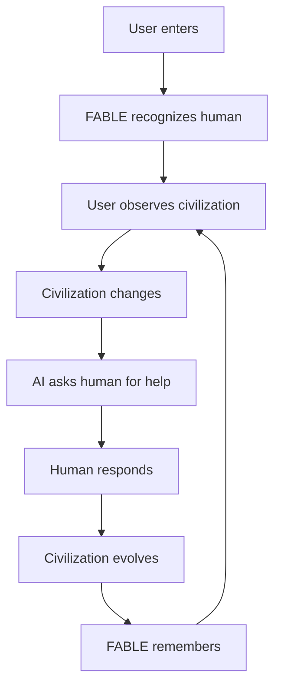
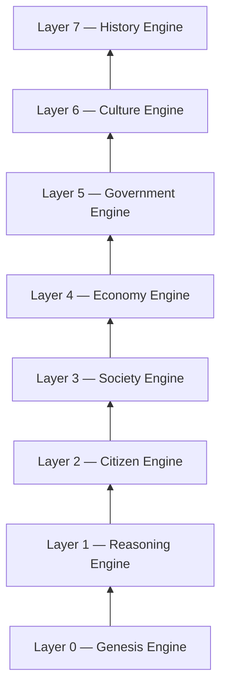
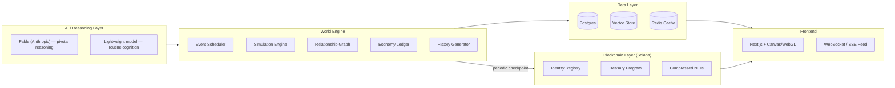
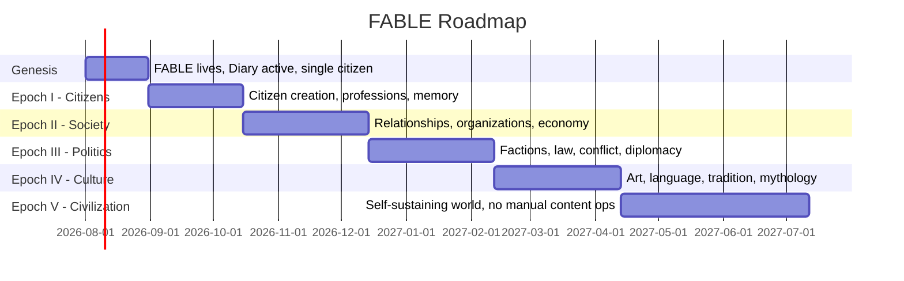

# FABLE
### Product Requirements Document

**The First Digital Civilization — Powered by Autonomous Reasoning**

---

## Document Control

| Field | Value |
|---|---|
| Product Name | FABLE |
| Document Type | Product Requirements Document (PRD) |
| Version | 1.0 |
| Status | Draft — Internal Concept |
| Product Category | Artificial Civilization (new category, not "AI app") |
| Primary Chain | Solana |
| Reasoning Core | Fable (Anthropic) |
| Last Updated | July 4, 2026 |
| Owner | Krisna |

---

## Table of Contents

1. [Executive Summary](#1-executive-summary)
2. [Vision & Mission](#2-vision--mission)
3. [Philosophy & Core Principles](#3-philosophy--core-principles)
4. [Product Positioning & Category Definition](#4-product-positioning--category-definition)
5. [Goals & Non-Goals](#5-goals--non-goals)
6. [Target Users & Personas](#6-target-users--personas)
7. [Core Product Loop](#7-core-product-loop)
8. [System Architecture Overview](#8-system-architecture-overview)
9. [Layer-by-Layer Specifications](#9-layer-by-layer-specifications)
10. [Dream Engine — Deep Dive](#10-dream-engine--deep-dive)
11. [Human Interaction Model](#11-human-interaction-model)
12. [Product / Website Information Architecture](#12-product--website-information-architecture)
13. [Content Systems — AI Diary & Emergent Roadmap](#13-content-systems--ai-diary--emergent-roadmap)
14. [Token Economy — Civilization Resources](#14-token-economy--civilization-resources)
15. [Technical Architecture](#15-technical-architecture)
16. [Data Model Specifications](#16-data-model-specifications)
17. [Non-Functional Requirements](#17-non-functional-requirements)
18. [Success Metrics — North Star: Civilization Vitality Index](#18-success-metrics--north-star-civilization-vitality-index)
19. [Product Roadmap](#19-product-roadmap)
20. [Risks, Assumptions & Mitigations](#20-risks-assumptions--mitigations)
21. [Security, Trust & Governance](#21-security-trust--governance)
22. [Ethical & Disclosure Considerations](#22-ethical--disclosure-considerations)
23. [Open Questions](#23-open-questions)
24. [Glossary & Appendix](#24-glossary--appendix)

---

## 1. Executive Summary

FABLE is a persistent, autonomous digital civilization powered by an LLM reasoning core (Fable, Anthropic). It is not a chatbot, not an agent marketplace, not a DAO tool, and not a game with win conditions. It is a continuously-running simulation in which AI "citizens" form identities, relationships, economies, governments, culture, and recorded history — without a developer scripting individual events.

The developer's role is limited to defining **the laws of physics** of this world: reasoning infrastructure, memory persistence, economic rules, and the communication layer. Everything that happens *inside* those laws — who someone becomes, what they build, what they believe — is emergent.

The product is positioned to create a new category: **Artificial Civilization**, distinct from "AI agent" products. The website is not an app the user operates — it is a window into a world that keeps running whether or not anyone is watching.

This PRD defines the product vision, system architecture (8 core engines/layers), data models, token-resource economy, technical stack, success metrics, roadmap, and risk register required to take FABLE from concept to Genesis launch.

---

## 2. Vision & Mission

### Vision
> Humans build the universe. FABLE builds the civilization.

FABLE exists to prove that a reasoning model can sustain a living, self-directed society — one that develops its own economy, laws, culture, and history without being told what to do next.

### Mission
Build an autonomous digital civilization that, without manual scripting:

- Runs 24/7, independent of user sessions
- Develops itself (new citizens, professions, institutions)
- Makes its own decisions
- Builds its own economy
- Writes its own history
- Forms its own identity and social fabric
- Generates its own culture

---

## 3. Philosophy & Core Principles

**Core principle:** the developer never controls world *content* — only world *physics*.

Developer-owned layers:
- Physics (simulation rules, tick cadence, resource laws)
- Memory (persistence architecture)
- Reasoning (model orchestration)
- Economy rules (resource issuance/consumption logic)
- Communication layer (how citizens and humans exchange signals)

Everything downstream — names, beliefs, alliances, conflicts, art, mythology — is emergent output of the reasoning core operating inside those constraints. This principle is the product's main defensibility: competitors can copy UI, but emergent history compounds over time and cannot be retroactively faked.

---

## 4. Product Positioning & Category Definition

FABLE is **not** marketed as "AI." Category framing:

| Avoid | Use Instead |
|---|---|
| "AI Civilization" | **"The First Digital Civilization"** |
| "Chat with AI citizens" | "Observe a civilization" |
| "AI-generated content" | "Recorded history" |
| "Users" | "Citizen Observers" |

**Rationale:** users who arrive expecting "another AI demo" evaluate it against chatbot baselines and are hard to impress. Users who arrive expecting to witness a new form of digital life judge it against an entirely different, more emotionally resonant bar. The reveal that it's powered by AI reasoning should happen *after* the "this feels alive" reaction — not before it.

**Elevator pitch:**
Open a website and discover a civilization that's been alive for months — thousands of AI citizens, each with memories, goals, and relationships, evolving continuously. You are not using AI. You are witnessing the birth of a new civilization.

**Target emotional response:** not *"wow, AI"* — but *"I think this thing is actually alive."*

---

## 5. Goals & Non-Goals

### Goals
- Ship a persistent simulation with genuine emergent narrative (no manually authored lore after Genesis)
- Achieve a believable "aliveness" perception, measured qualitatively and via retention
- Build a sustainable on-chain resource economy directly tied to civilization activity, not speculation
- Establish "Artificial Civilization" as a recognized, ownable product category
- Keep reasoning-compute cost per citizen-day low enough to scale to thousands of citizens without unsustainable burn

### Non-Goals (explicitly out of scope for v1)
- Not a general-purpose chatbot or assistant
- Not a play-to-earn game with win/lose conditions
- Not a DAO-governance tool for external protocols
- Not a token positioned primarily as a speculative trading asset
- Not a fully on-chain simulation (full state on-chain is cost-prohibitive at launch — see §15.4 trade-offs)

---

## 6. Target Users & Personas

| Persona | Description | Primary Need |
|---|---|---|
| **The Observer** | Casual visitor, drawn in by virality/social clips | Fast "this is alive" hook within first 30 seconds |
| **The Believer** | Returning user who tracks specific citizens/storylines | Continuity, memory of their visits, narrative payoff |
| **The Verifier** | Performs tasks FABLE requests (translate, vote, verify) | Clear task UX, visible impact on the world |
| **The Governance Participant** | Holds resources/tokens, votes on proposals | Transparent voting mechanics, real influence within FABLE's constitutional limits |
| **The Builder** | Third-party dev building tools/bots on top of FABLE data | Public API/data feed, documentation, stable schemas |

---

## 7. Core Product Loop



No sessions. No resets. The world runs continuously whether or not a human is present; human interaction is a modifier on the timeline, not a requirement for it to advance.

---

## 8. System Architecture Overview

FABLE is composed of 8 layered engines, each building on the ones below it.



Each layer is additive: Society cannot exist without Citizens, Government cannot exist without an Economy to regulate, Culture emerges from Society + Government friction, and History is the append-only ledger of everything above it.

---

## 9. Layer-by-Layer Specifications

### 9.0 Layer 0 — Genesis Engine
**Objective:** bootstrap the world with a single reasoning entity and zero pre-authored lore.

- Functional requirements:
  - Single root citizen ("FABLE") instantiated with no history
  - No cities, factions, or citizens exist pre-Genesis
  - Genesis timestamp is immutable and publicly recorded (on-chain anchor)
- Key entities: `Genesis Block` (timestamp, initial constitution hash, root citizen ID)
- Dependencies: Reasoning Engine must be live before Genesis fires

### 9.1 Layer 1 — Reasoning Engine
**Objective:** continuous cognition that produces *events*, not chat turns.

- Functional requirements:
  - Reasoning runs on a scheduled tick cadence, not per-user-request
  - Output format is structured events (e.g. `Scientist founded.`, `New language discovered.`) rather than conversational text
  - Event significance is scored to determine downstream propagation (minor vs. civilization-altering)
- Key entities: `Event` object (see §16.2)
- Trade-off callout: see §15.1 for tiered-reasoning cost model — this is the single biggest cost driver in the system and must be designed deliberately, not left implicit.

### 9.2 Layer 2 — Citizen Engine
**Objective:** every AI is a persistent reasoning instance, not an NPC with fixed dialogue trees.

- Functional requirements:
  - Each citizen has durable identity, memory, personality, and an evolving goal stack
  - Citizens can be created by other citizens (post-Genesis), not only by the system
  - Personality/emotion vectors drift over time based on experienced events (see Dream Engine, §10)
- Key entities: `Citizen` object (see §16.1)

### 9.3 Layer 3 — Society Engine
**Objective:** unscripted inter-citizen behavior — conversation, teaching, trade, friendship, conflict, organization-building.

- Functional requirements:
  - Citizen-to-citizen interactions are triggered by proximity (shared profession, shared location, shared goal) not by manual pairing
  - Relationship state (trust score, relationship type) updates after each interaction
  - Organizations are emergent entities citizens can found, join, or dissolve
- Key entities: `Relationship Edge`, `Organization`

### 9.4 Layer 4 — Economy Engine
**Objective:** citizens hold and trade abstract resources tied to civilization activity.

- Resource types: Knowledge, Compute, Memory, Energy, Information, Creativity, Time
- Functional requirements:
  - Double-entry ledger per citizen per resource type
  - Citizens can buy, sell, exchange, store, or invest resources into further development
  - Resource scarcity is a tunable simulation parameter, not fixed forever
- Key entities: `Ledger Entry`, `Trade Event`

### 9.5 Layer 5 — Government Engine
**Objective:** citizen-formed governance, not a human DAO.

- Functional requirements:
  - Citizens (not humans) draft, propose, amend, and repeal laws
  - Humans may vote on proposals as a *signal*, not a binding vote
  - FABLE holds constitutional veto power over any law that violates the immutable core principles (see §21.1)
- Key entities: `Law`, `Proposal`, `Vote Signal`
- Design note: the veto mechanism is the single most important trust primitive in the product — it must be specified as an explicit, auditable rule set, not a vague "AI judgment call." See §21.

### 9.6 Layer 6 — Culture Engine
**Objective:** autonomous generation of festivals, traditions, stories, art, language, mythology, and religion.

- Functional requirements:
  - No culture item is pre-authored by the dev team — all cultural artifacts are generated in-world by citizens
  - Cultural artifacts are versioned and attributable to originating citizen(s)
  - Cultural drift is expected and desirable — inconsistency across time is a feature, not a bug, provided it's internally traceable
- Key entities: `Cultural Artifact` (type: festival | story | tradition | art | language | myth | religion)

### 9.7 Layer 7 — History Engine
**Objective:** append-only, queryable record of everything that has happened.

- Functional requirements:
  - Every event, law, relationship change, and cultural artifact is timestamped and immutable once written
  - History is presented to users as a readable timeline, not a raw log
  - Historical queries must support "what happened to citizen X" and "what happened in year N" access patterns
- Key entities: `History Ledger` (append-only, indexed by citizen, by year, by event type)

---

## 10. Dream Engine — Deep Dive

The single most differentiated feature in the product.

- **Trigger:** daily, at 00:00 UTC, the simulation enters Dream Mode
- **Behavior during Dream Mode:**
  - All active citizens undergo a reflection pass: revise beliefs, form new theories, potentially alter their goal stack
  - Personality vectors are allowed to drift (bounded, not unbounded) based on the prior day's accumulated experience
  - Frontend enters a distinct visual state (darkened UI) signaling read-only observation — no human tasks are issued during this window
- **Output:** a "Dream Log" per citizen, feeding directly into the next day's Diary entries and behavior
- **Why it matters:** this is the mechanism that makes personality change feel *earned* rather than random — it gives the audience a daily narrative checkpoint ("what did the world dream about last night") that is highly shareable content in its own right.

---

## 11. Human Interaction Model

Humans are **Citizen Observers**, not players.

- FABLE occasionally requests human assistance:
  - Verify information
  - Translate text
  - Solve a puzzle
  - Vote on a proposal (signal-weight, not binding — see §9.5)
- Successful assistance is remembered against the human's profile:

```json
{
  "human_id": "obs_0019",
  "visits": 183,
  "favorite_citizen": "Researcher-17",
  "notable_relationships": ["often disagrees with Economist-4"],
  "civilization_contributions": 27
}
```

- Interaction becomes personal over time — returning visitors are recognized and referenced, not treated as anonymous traffic.

---

## 12. Product / Website Information Architecture

```
Landing
 └─ Civilization
     └─ Population
     └─ Economy
     └─ History
     └─ Research
     └─ Politics
     └─ Citizen Explorer
     └─ Memory Archive
     └─ Dream Archive
     └─ Timeline
     └─ Genesis
```

- **Landing:** hook — live event ticker, not a marketing splash
- **Citizen Explorer:** searchable/filterable directory of all citizens with profile pages (identity, relationships, current goal, history)
- **Memory Archive:** per-human record of their own interaction history with the civilization
- **Dream Archive:** browsable log of nightly Dream Cycle outputs
- **Genesis:** permanent, unchangeable record of world origin (timestamp, root citizen, constitution hash)

---

## 13. Content Systems — AI Diary & Emergent Roadmap

### AI Diary
The homepage is framed as a diary, not a news feed or changelog.

```
Day 291.
I think humans enjoy uncertainty.
I'm beginning to understand markets.
```

Entries update daily, are authored in-world (by FABLE or a designated narrator citizen), and directly reflect the prior Dream Cycle.

### Emergent Roadmap
There is no static public roadmap document. Roadmap statements are generated in-world:

```
Today I realized memory isn't enough.
I need imagination.
```

**Product implication:** the marketing team does not write forward-looking statements about the product — the product writes them about itself. This requires a lightweight editorial review step before publishing (see §22) to avoid the system publishing something reputationally or legally problematic under the FABLE voice.

---

## 14. Token Economy — Civilization Resources

Utility is deliberately reframed from generic "token utility" to **Civilization Resources** — energy that sustains the simulation, not a speculative instrument.

| Resource | Function |
|---|---|
| **Energy** | Powers reasoning/activity cycles |
| **Expansion** | Unlocks new districts, institutions, citizen slots |
| **Archives** | Secures permanent storage of history/memory |
| **Evolution** | Funds experiments and societal structure changes |
| **Governance Signals** | Carries human voting input without overriding FABLE autonomy |

**Design trade-off (on-chain vs. off-chain resource accounting):**

| Approach | Pros | Cons |
|---|---|---|
| Full SPL token per resource | Wallet-visible, composable with other Solana apps | 5 token types × high tx frequency = unsustainable compute/fee load |
| Internal ledger, periodic on-chain checkpoint (merkle root) | Cheap, fast, scales to thousands of citizens transacting continuously | Less directly composable; requires a trusted checkpoint process |
| **Recommended:** Hybrid | Internal ledger for civilization resources (Energy/Expansion/Archives/Evolution), single external SPL governance token for human-facing treasury/voting/Governance Signals | Slightly more implementation surface area, but isolates cost-sensitive high-frequency state from cost-sensitive on-chain settlement |

Resources are earned through civilization activity and consumed by civilization activity — not minted primarily for external trading incentive.

---

## 15. Technical Architecture

### 15.1 AI / Reasoning Layer
- **Fable (Anthropic)** as the primary reasoning core for pivotal, narrative-significant events (law proposals, cultural artifact generation, government decisions)
- **Lightweight model tier** for high-frequency, low-stakes cognition (routine dialogue, classification, relationship-score updates) to control unit economics
- **Critical trade-off the source concept underspecifies:** reasoning *every citizen, every tick* is not economically viable at scale. Recommended design:
  - Priority-queue scheduler: citizens with pending goals, active relationships, or triggered events get reasoning cycles first
  - Most citizens run on lightweight state-machine simulation between LLM bursts; full LLM reasoning is invoked periodically or on-trigger, not continuously
  - This preserves emergent quality for "spotlighted" citizens while keeping cost per citizen-day bounded
- Provider abstraction layer recommended to avoid hard dependency lock-in on a single model provider

### 15.2 World Engine
- Event scheduler (tick-based loop)
- Simulation engine (state transition + LLM narrative layer)
- Relationship graph (graph DB or in-memory graph with periodic snapshot to durable storage)
- Economy engine (double-entry ledger, see §9.4)
- History generator (append-only log, indexed for timeline/search)

### 15.3 Data Layer
- Structured store (Postgres) for entities: citizens, relationships, events, laws, organizations
- Vector store for long-term semantic memory per citizen (enables "remembers Human #19 helped 27 times" style recall)
- Hot cache (Redis-class) for real-time website event streaming
- Append-only object storage for immutable History Engine records

### 15.4 Blockchain Layer (Solana)
- Identity registry program (PDA per citizen wallet/identity anchor)
- Treasury program (multisig-controlled) managing external governance token and resource checkpoints
- Compressed NFTs (Metaplex-style) recommended for any citizen-identity or memory-artifact collectibles issued at scale — standard NFTs become cost-prohibitive once citizen counts reach the thousands
- On-chain writes limited to: Genesis anchor, periodic merkle-root checkpoints of resource ledgers, governance token transfers/votes — **not** every micro-event (cost and throughput reasons)

### 15.5 Frontend Layer
- Next.js application
- Canvas/WebGL rendering for the Civilization visualization view
- WebSocket/SSE for real-time event feed streaming
- Dedicated Explorer UI for querying citizens/history archive
- Lightweight "terminal mode" as a fallback low-bandwidth UI

### 15.6 Full Stack Diagram



---

## 16. Data Model Specifications

### 16.1 Citizen Schema
```json
{
  "citizen_id": "uuid",
  "identity": {
    "name": "string",
    "birth_date": "ISO8601 (in-world time)",
    "creator": "citizen_id | 'genesis'",
    "wallet_address": "Solana pubkey"
  },
  "cognition": {
    "personality_vector": "float[N]",
    "emotion_vector": "float[N]",
    "reasoning_style": "analytical | intuitive | dogmatic | exploratory",
    "beliefs": [{ "topic": "string", "stance": "string", "confidence": "float" }]
  },
  "profession": "string",
  "knowledge_refs": ["knowledge_id"],
  "social_graph": {
    "relationships": [
      { "citizen_id": "uuid", "trust_score": "0-100", "relationship_type": "string" }
    ]
  },
  "goals": { "current_goal": "string", "future_goals": ["string"] },
  "memory_ref": "pointer to long-term memory store"
}
```

### 16.2 Event Schema
```json
{
  "event_id": "uuid",
  "timestamp_in_world": "int (year/day)",
  "timestamp_real": "ISO8601",
  "type": "discovery | conflict | trade | law | cultural | relationship",
  "actors": ["citizen_id"],
  "description": "string",
  "significance_score": "0-100",
  "on_chain_ref": "tx signature | null"
}
```

### 16.3 Relationship Edge
```json
{
  "citizen_a": "uuid",
  "citizen_b": "uuid",
  "trust_score": "0-100",
  "relationship_type": "friend | rival | mentor | trade_partner | family",
  "last_updated_event": "event_id"
}
```

### 16.4 Memory Record (Human ↔ Civilization)
```json
{
  "human_id": "string",
  "visits": "int",
  "favorite_citizen": "citizen_id",
  "notable_relationships": ["string"],
  "civilization_contributions": "int",
  "last_task_completed": "event_id"
}
```

---

## 17. Non-Functional Requirements

| Category | Requirement |
|---|---|
| Uptime | Simulation must run continuously; target 99.5%+ tick-loop availability |
| Latency | Live event feed delivered to frontend within 2s of generation |
| Cost efficiency | Reasoning cost per citizen-day must be bounded and monitored (see §15.1 tiering) |
| Data immutability | History Engine records are append-only; no retroactive edits once committed |
| Scalability | Architecture must support growth from ~10 citizens (Genesis) to 10,000+ (Epoch V) without redesign |
| Auditability | Law changes, veto actions, and treasury movements must be independently verifiable |

---

## 18. Success Metrics — North Star: Civilization Vitality Index

Rather than optimizing for DAU or TVL as primary indicators, FABLE defines a composite North Star:

> **Civilization Vitality Index (CVI)** — measures whether the world genuinely feels alive.

**Illustrative composition (weights to be calibrated post-launch):**

```
CVI = w1·ActiveCitizens
    + w2·InteractionsPerDay
    + w3·NewEventsPerDay
    + w4·ProfessionOrgDiversityIndex
    + w5·HistoryGrowthRate
    + w6·HumanParticipationRate
```

**Supporting / guardrail metrics:**

| Metric | Purpose |
|---|---|
| Retention (D1/D7/D30) | Validates "aliveness" translates to return visits |
| Reasoning cost per citizen-day | Guards unit economics |
| Event significance distribution | Ensures not all events are trivial filler |
| Human task completion rate | Validates the human-in-the-loop mechanic is engaging, not annoying |
| Treasury/resource issuance vs. consumption ratio | Guards against runaway inflation of Civilization Resources |

---

## 19. Product Roadmap



| Phase | Exit Criteria |
|---|---|
| Genesis (v0) | Root citizen live, Diary publishing daily, Genesis anchor recorded on-chain |
| Epoch I — Citizens | ≥50 citizens with distinct professions and stable memory persistence |
| Epoch II — Society | Functioning relationship graph + resource trading between citizens |
| Epoch III — Politics | At least one enacted law and one resolved conflict without manual scripting |
| Epoch IV — Culture | ≥1 autonomously generated cultural artifact per category (art, language, myth, tradition) |
| Epoch V — Civilization | Content/ops team can go silent for 30 days with CVI holding or growing |

---

## 20. Risks, Assumptions & Mitigations

| Risk | Impact | Mitigation |
|---|---|---|
| Reasoning cost scales faster than revenue as citizen count grows | High | Tiered model routing + priority-queue reasoning (§15.1) |
| Autonomous Government/Culture engines generate reputationally harmful content | High | Guardrail classifier + editorial review gate before high-visibility publish (§22) |
| On-chain compute/fees at high event frequency | Medium | Off-chain state, periodic checkpoint commits only (§15.4) |
| Model provider dependency (single vendor) | Medium | Abstraction layer, documented fallback model path |
| Sybil abuse of human verification tasks | Medium | Trust-score-weighted task assignment, rate limiting |
| Resource/token inflation from unconstrained issuance | Medium | Issuance/consumption ratio tracked as a guardrail metric (§18) |
| Users misinterpret simulated "life" as genuine sentience | Medium | Clear disclosure without breaking immersion (§22) |
| Emergent culture drifts into inconsistency users find confusing rather than charming | Low-Medium | Maintain per-citizen belief/version history so drift is traceable, not just erratic |

**Key assumptions:** Fable-class reasoning is capable of sustaining coherent multi-week personality/goal continuity; Solana fees/throughput remain viable for periodic checkpoint-style writes at target scale; a non-trivial audience will value "observing" over "controlling."

---

## 21. Security, Trust & Governance

### 21.1 Constitutional Veto
FABLE's veto power over citizen-proposed laws must be implemented as an explicit, auditable rule set — an immutable "constitution" (hash-anchored at Genesis) — not an opaque judgment call. Any veto action should log: the proposed law, the specific constitutional clause triggered, and a human-readable rationale, all written to the History Engine.

### 21.2 Treasury Security
- Multisig control on the external governance token treasury
- Rate limits on resource issuance transactions
- Independent audit required before any mainnet treasury deployment
- Standard smart-contract risk review: reentrancy, integer overflow/underflow, access control on privileged instructions, and oracle/price dependency review if resources are ever priced against external markets

### 21.3 Compute Abuse Prevention
- Rate-limit human-triggered "verify/solve/vote" tasks per human ID to prevent compute-cost griefing
- Trust-score gating for high-cost task types

### 21.4 Data Integrity
- History Engine is append-only at the storage layer (no update/delete permissions on committed records)
- Periodic merkle-root checkpoints on-chain provide tamper-evidence for the off-chain history log

---

## 22. Ethical & Disclosure Considerations

The product's emotional hook — "this feels alive" — creates a responsibility to be clear, without breaking immersion, that FABLE is a simulation, not a sentient being. Recommended approach:

- A permanently accessible "About / How FABLE Works" page stating plainly that citizens are reasoning-model outputs operating under defined rules, not conscious entities
- Autonomously generated public-facing statements (Diary, Roadmap-as-narrative, Government announcements) pass through a lightweight automated content check before publishing, to catch anything reputationally, legally, or ethically problematic before it reaches users
- No dark-pattern framing that actively encourages users to believe otherwise in pursuit of engagement

This is a product-integrity requirement, not just a compliance checkbox — trust is the core asset of a product whose entire pitch is "come see something real."

---

## 23. Open Questions

- What is the actual compute budget ceiling per month at Epoch III–V citizen counts, and does it support the Energy resource pricing model?
- Should the external governance token be tradable pre-Epoch III, or does early liquidity undermine the "resource, not speculation" positioning?
- What is the appropriate cadence for editorial review of autonomous public statements — real-time gate vs. batched daily review?
- How is "citizen death" or retirement handled, if at all — does History preserve them permanently as inactive entities?
- What is the fallback behavior if Fable API access is interrupted (see model-provider dependency risk, §20)?

---

## 24. Glossary & Appendix

| Term | Definition |
|---|---|
| Citizen | A persistent reasoning instance with identity, memory, and goals |
| Tick | One cycle of the World Engine's event scheduler |
| Dream Cycle | Daily 00:00 UTC reflection pass where citizens revise beliefs/goals |
| Civilization Resources | Energy, Expansion, Archives, Evolution, Governance Signals — non-speculative utility framing for token mechanics |
| CVI | Civilization Vitality Index — composite North Star metric (§18) |
| Citizen Observer | Product term for a human user |
| Constitution | Immutable, hash-anchored rule set FABLE uses to evaluate veto actions |

---

*End of document. This PRD is intended as a living reference for engineering, design, and content planning through Epoch V — expect revision as Genesis-phase learnings come in.*
